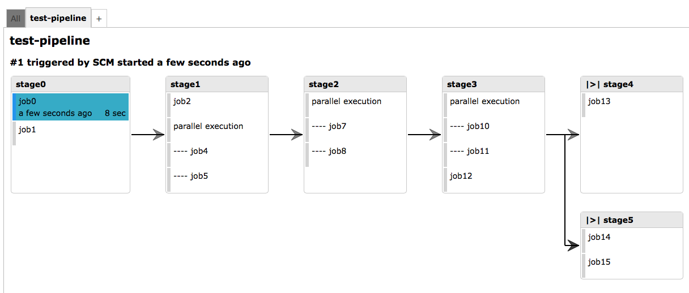

# pipeline-generator
Declare jenkins pipelines using a json configuration file.

# try it out

This uses an example configuration of this project to demo features:

  - clone this project from git into
  - run `make example`
  - adjust the file `Pipeline` to point to your test jenkins server
  - execute `./ppl-example create test-pipeline` -- repeat until no errors are reported (it'll complain on missing jenkins plugins which you will need to install)
  - open url that is displayed
  - either wait ~1 minute or trigger the job called `test-pipeline` by hand and go back to the pipeline view
  - in order to delete the pipeline and its jobs again call `./ppl-example delete test-pipeline`

# configuration file format

the configuration for this pipeline:

looks as follows:

    {
        "stages": [
            {
                "name": "stage0",
                "jobs": [
                    { "job0": {"cmd": "echo 'job0'; mv spec spec2", "artifact": "spec2/" } },
                    { "job1": "echo 'job1'; find ." }
                ],
                "next-stages": [ "stage1" ]
            },
            {
                "name": "stage1",
                "jobs": [
                    { "job2": {"cmd": "echo 'job2'; cp -a spec spec1; cp -a spec spec2", "artifact": "spec1/,spec2/" } },
                    [
                        { "job4": {"cmd": "echo 'job4'; mv spec1 spec3", "artifact": "spec3/"} },
                        { "job5": {"cmd": "echo 'job5'; mv spec2 spec4", "artifact": "spec4/"} }
                    ]
                ],
                "next-stages": [ "stage2" ]
            },
            {
                "name": "stage2",
                "jobs": [
                    [
                        { "job7": {"cmd": "echo 'job7'", "no-clean": true} },
                        { "job8": "echo 'job8'" }
                    ]
                ],
                "next-stages": [ "stage3" ]
            },
            {
                "name": "stage3",
                "jobs": [
                    [
                        { "job10": {"cmd": "echo 'job10'", "artifact": "art1"} },
                        { "job11": {"cmd": "echo 'job11'", "artifact": "art2"} }
                    ],
                    { "job12": "echo notify" }
                ],
                "next-stages": [ "stage4", "stage5" ]
            },
            {
                "name": "stage4",
                "jobs": [
                    { "job13": {"cmd": "echo 'job13'", "manual": true} }
                ]
            },
            {
                "name": "stage5",
                "jobs": [
                    { "job14": "echo 'job14'" },
                    { "job15": "echo 'job15'" }
                ]
            }
        ],
        "settings": {
            "jenkins-server": "http://jenkins:8080",
            "git-url": "http://github.com/kesselborn/tuev",
            "slave-label": "master",
            "working-dir": "subdir",
            "job-setup": "export VAR=foobar"
        }
    }

## stages section

The stages section contains an array of stages declarations that contain the following properties:

  - `name`: the name of the stage
  - `jobs`: an array of job declarations with the following format:
      - simple job declaration: name / command: 
       
            {"<jobname>": "<command>"}
      - extended job declaration:
       
            {"<jobname>": {"cmd": "<command>", "<option1>": "<option1-value>", "<option2>": "option2-value"}, ... }

       with the following options being available:

      `artifact`: pass on the listed artifacts (files or directories) to the next job. If the next job is a multi job, all sub-jobs will have the listed artifacts available. If several sub-jobs of a multi-job (see below) provide artifacts, the next job after the multi job will have all artifacts of all sub jobs available: in the example, `job7` and `job8` (sub-jobs of a multi-job) will receive the artifacts `spec3/` and `spec4/` from sub-jobs `job4` and `job5`.

      `upstream-jobs`: an array of strings with job names that should trigger this pipeline after they have a successful new build
      `downstream-jobs`: an array of strings with job names that should be triggered when this pipeline was built successfully

      `no-clean`: if set to true, the workspace will not be cleaned before starting the job (default is to always clear workspace -- us this if you would like to cache dependencies or build artifacts between builds)

      `manual` (bool): if set to true, this job needs to be triggered manually by a user using the jenkins ui -- if omitted or set to false, job gets triggered automatically by its upstream jobs

      - multi job: an array of simple or extended job declarations (see `stage1 / job4 & job5` in example above). Those jobs will be executed in parallel:

            [<simple-job-decl>,<ext-job-decl>,<simple-job-decl>, ...]

  - `next-stages` (optional): next stages to execute when this stage has been executed successfully

## settings section

This section contains global settings for the pipeline:

  - `jenkins-server`: base url to the jenkins server
  - `git-url`: git url to the project that is to be built
  - `slave-label` (optional): only execute these jobs on jenkins slave with this label
  - `job-setup` (optional): before executing each job, execute the code provided here
  - `silent` (optional): if set to true, don't send notification mails -- if omitted or false, sent mails
  - `default-name` (optional): optionally, define how your pipeline should be named here; this property will be available on 
  - `working-dir` (optional): only consider the given subdir: only builds if the subdir contains changes; changes into the subdir before executing anything, i.e. all commands are relativ to the subdir, not the repository's root

## Versioning
This library aims to adhere to [Semantic Versioning 2.0.0][semver]. Violations
of this scheme should be reported as bugs. Specifically, if a minor or patch
version is released that breaks backward compatibility, that version should be
immediately yanked and/or a new version should be immediately released that
restores compatibility. Breaking changes to the public API will only be
introduced with new major versions.

[semver]: http://semver.org/

## Copyright
Copyright (c) 2014 Daniel Bornkessel

See [LICENSE][] for details.

[license]: LICENSE.md
